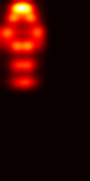

# PoseGAN – Pose-Based Human Image Generation

## Overview
This project implements **Deformable Generative Adversarial Networks (Deformable GANs)** for **pose-guided human image generation**.

Given a **source image of a person** and a **target pose**, the model synthesizes a new image of the *same person* accurately reposed according to the target pose while preserving identity and appearance.

---

## Learning Path & Implementation Strategy

The project was built progressively to ensure strong conceptual and practical understanding:

1. Studied the fundamentals of **Neural Networks and Machine Learning**.
2. Implemented **MNIST digit classification** using:
   - 1-layer and 2-layer Artificial Neural Networks  
   - NumPy (from scratch).
3. Learned **optimizers, hyperparameter tuning**, and **CNN fundamentals**, along with common architectures.
4. Reimplemented MNIST using **PyTorch**:
   - 2-layer ANN
   - Deep CNN architecture.
5. Built a **deep CNN-based object recognition model** on the **CIFAR-10 dataset**, incorporating:
   - Batch normalization  
   - Dropout regularization.
6. Implemented **Generative Adversarial Networks (GANs)** for digit generation and extended them to **Conditional GANs (cGANs)**.
7. Finally, implemented **pose-based human image generation** in PyTorch using the **Market-1501 dataset**, inspired by the following research work:  
   https://openaccess.thecvf.com/content_cvpr_2018/papers/Siarohin_Deformable_GANs_for_CVPR_2018_paper.pdf

---

## Custom Dataset – `MarketPoseDataset`

A custom PyTorch dataset class, `MarketPoseDataset`, was created to support pose-guided image generation.

Each dataset sample contains **paired images of the same person in different poses**, along with their corresponding pose representations.

### Each sample returns:
- Source image
- Target image
- Source pose heatmap
- Target pose heatmap

<table>
  <tr>
    <th>Body Heatmap</th>
    <th>Source Image</th>
    <th>Source Img</th>
  </tr>
  <tr>
    <td style="padding-right:50px;"></td>
    <td style="padding-right:50px;"></td>
    <td></td>
  </tr>
</table>

### Pose Heatmap Generation

- **18 human body keypoints** are extracted from each image using a YOLO-based pose estimation model.
- These keypoints are converted into **pose heatmaps**.
- Heatmaps are transformed into tensors and used as conditioning inputs during training.

### Pairing Strategy

- The **Market-1501 dataset** contains multiple images per person ID.
- Image pairs are created using the same person ID to ensure **identity consistency** while allowing **pose variation**.

---

## Model Architecture Overview

The system follows a **GAN-based pose-guided image synthesis framework** consisting of two main components:
MODEL ARCHITECTURE

- **Generator (Pose-Guided Deformable Generator)**  
- **Discriminator**

The generator produces pose-aligned images, while the discriminator enforces realism, pose correctness, and identity preservation.

---

## Generator & Discriminator Overview

### Generator – Pose-Guided Deformable Generator

The generator follows an **encoder–decoder architecture** with **deformable skip connections**, enabling it to handle large pose variations while preserving the person’s identity and appearance.

#### Inputs
- **Xₐ**: Source image  
- **Hₐ**: Source pose heatmap  
- **Hᵦ**: Target pose heatmap  

---

### Generator Output
The generator produces a synthesized image *(x̂ᵦ)* that:
- Matches the target pose *(Hᵦ)*
- Preserves the identity and appearance of the source person

### Pose–Appearance Modeling Strategy

Standard convolutional layers struggle to jointly represent **appearance** (texture, clothing, color) and **pose** (body layout).

To address this, the generator uses a **dual-encoder design**:
- A **source encoder** processes *(Xₐ, Hₐ)* to capture appearance and identity.
- A **target encoder** processes *(Hᵦ)* to learn the target pose structure.

Appearance features are then **deformably warped** based on the pose difference between *(Hₐ)* and *(Hᵦ)*.  
These aligned features are passed to the decoder through **deformable skip connections**, enabling accurate reconstruction of the final image.

---

---

### Discriminator

The discriminator evaluates the realism and consistency of generated images.  
It receives the following inputs:
- A **real pair** *(xᵦ, Hᵦ)*
- A **generated pair** *(x̂ᵦ, Hᵦ)*
- A **source reference** *(xₐ, Hₐ)* for identity comparison

Its objectives are to:
- Distinguish real images from generated ones
- Enforce identity consistency with the source image
- Verify correct alignment with the target pose

---

## Loss Functions

### Discriminator Loss (L_D)
Encourages accurate classification of real and generated images.

### Generator Loss (L_G)

| Loss Type | Purpose | Effect |
|---------|---------|--------|
| **Perceptual Loss** | Measures high-level feature similarity | Preserves visual realism, fine details, and reduces blurriness |
| **Nearest Neighbour Loss** | Preserves local texture and structure | Handles minor spatial misalignments better than pixel-wise losses |
| **Offset Smoothness Loss** | Regularizes deformable offsets | Ensures smooth spatial transformations and prevents distortions |

---

## Results

---

## Key Takeaways

- Dual encoders disentangle appearance and pose information
- Deformable warping enables accurate pose alignment
- Skip connections preserve fine-grained details
- Adversarial training enforces realism and identity consistency

- ---

## References

This project is an implementation attempt inspired by the architecture proposed in the following work:

Siarohin, A., Sangineto, E., Lathuilière, S., & Sebe, N. (2019).  
**Appearance and Pose-Conditioned Human Image Generation using Deformable GANs**.  
arXiv preprint arXiv:1905.00007  
https://arxiv.org/abs/1905.00007

An earlier version of this work appeared at CVPR 2018 under the title:  
**Deformable GANs for Pose-based Human Image Generation**.

### Acknowledged Code Repositories
- Original TensorFlow implementation:  
  https://github.com/AliaksandrSiarohin/pose-gan
- PyTorch reference implementation:  
  https://github.com/saurabhsharma1993/pose-transfer

